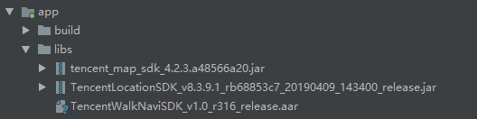
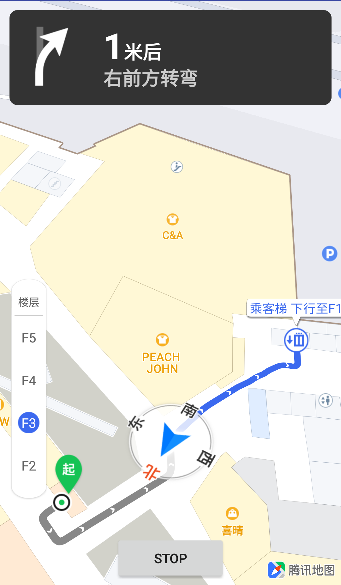
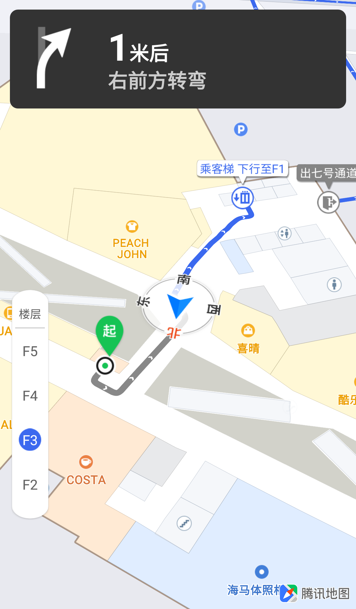
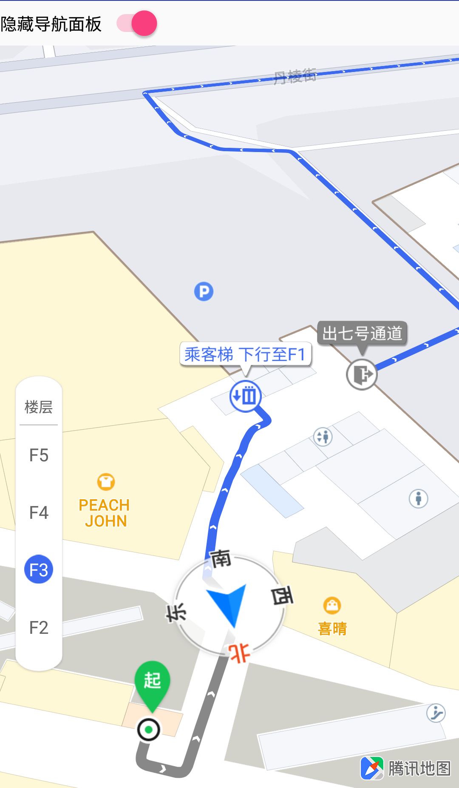
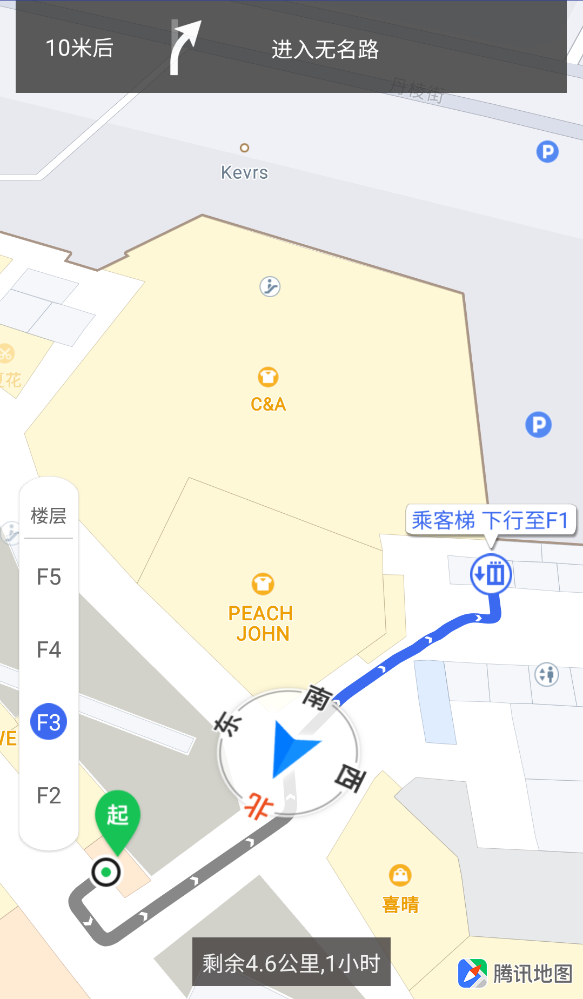
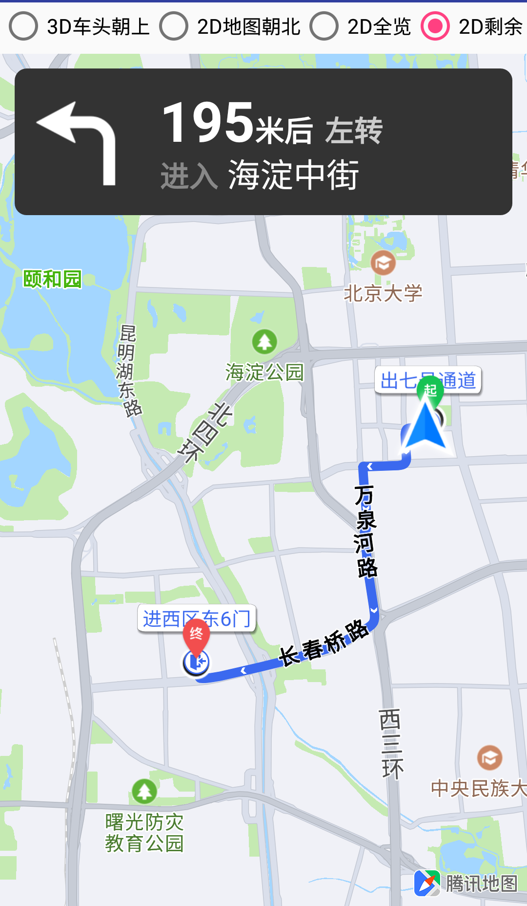

# 一体化导航SDK


[TOC]

### 介绍

室内外一体化步行导航SDK提供步行在线导航功能。该产品的路径计算与实时交通信息相结合，提供路径规划、模拟导航、实时导航、导航设置、自定义导航界面等功能，力求为用户提供更加人性化的导航服务。

兼容性：支持 Android 4.0 及以上系统。

### 工程配置

这里我们提供Android Studio的腾讯地图SDK的工程配置方法。

#### 使用aar/jar包集成SDK

室内外一体化步行导航SDK需要结合腾讯定位SDK和腾讯地图SDK一起使用，请到腾讯[位置服务官网](https://lbs.qq.com/)下载相应的压缩包并解压。

1、添加aar / jar包

将jar包或aar包复制到app/libs目录下，如下图所示：



然后在module的build.gradle里修改dependencies：

```properties
dependencies {
	implementation fileTree(include: ['*.jar', '*.aar'], dir: 'libs')
	...
}
```

2、添加so库

有两种添加so库的方法：

方法一：

新建app/src/main/jniLibs目录，将解压的so库文件复制到该目录下。如图所示：


方法二：

将so库拷贝到libs目录下，如图所示：


然后在module的build.gradle里修改android，找到或添加sourceSets 标签，在里面增加一项配置：

```properties
android {
	...
	sourceSets.main{
        jniLibs.srcDirs = ['libs']
	}
	...
}
```

上述步骤完成之后，rebuild一下即可。

#### 使用maven集成SDK

首先在工程顶级 build.gradle 文件中加入：

```properties
buildscript {
    repositories {
        maven {
            url "https://oss.sonatype.org/content/groups/public"
        }
        maven {
            url "https://oss.sonatype.org/content/repositories/snapshots/"
        }
        mavenLocal()
        mavenCentral()
        jcenter()
        google()
    }
    dependencies {
        classpath 'com.android.tools.build:gradle:3.3.2'
        
        // NOTE: Do not place your application dependencies here; they belong
        // in the individual module build.gradle files
    }
}

allprojects {
    repositories {
        maven {
            url "https://oss.sonatype.org/content/groups/public"
        }
        maven {
            url "https://oss.sonatype.org/content/repositories/snapshots/"
        }
        mavenLocal()
        mavenCentral()
        jcenter()
        google()

        flatDir {
            dirs'libs'
        }
    }
}

task clean(type: Delete) {
    delete rootProject.buildDir
}
```

然后module build.gradle 文件中添加依赖库名称：

```properties
dependencies {
    implementation 'com.tencent.map:tencent-walk-nav-sdk:latest.release'//获取最新版本号
}
```

最后rebuild一下即可。

#### 权限申请

室内外一体化导航SDK需要使用网络、获取位置、访问硬件存储等系统权限，在AndroidManifest.xml文件里，添加如下权限：

```xml
<!--腾讯室内外一体化导航SDK要求的权限(开始)-->
<uses-permission android:name="android.permission.ACCESS_FINE_LOCATION" />
<uses-permission android:name="android.permission.ACCESS_COARSE_LOCATION" />
<uses-permission android:name="android.permission.ACCESS_NETWORK_STATE" />
<uses-permission android:name="android.permission.INTERNET" />
<uses-permission android:name="android.permission.READ_PHONE_STATE" />
<uses-permission android:name="android.permission.WRITE_EXTERNAL_STORAGE" />
<!--腾讯室内外一体化导航SDK要求的权限(结束)-->
```

#### 混淆配置

如果需要混淆您的工程，请在module里找到proguard-rules.pro文件，添加如下混淆脚本：

```properties
-keep public class com.tencent.map.engine.walk.WalkEngineJNI {
	native <methods>;
	public native <methods>;
	public static native <methods>;

	private int callback(...);
}
```

然后在module的build.gradle文件中引用该混淆文件：

```properties
buildTypes {
  release {
     minifyEnabled true
     proguardFiles getDefaultProguardFile('proguard-android.txt'), 'proguard-rules.pro'
  }
}
```

### Key配置

要正常使用腾讯地图SDK用户需要在[腾讯位置服务官网](<https://lbs.qq.com/console/key.html>)申请开发密钥，申请开发密钥是免费的，腾讯地图SDK的使用也是免费的。

开发者申请key后，把Key输入工程的AndroidManifest.xml文件中，在application节点里，添加名称为TencentMapSDK的meta，如下所示(value值为申请的key)：

```xml
<application
    ...
	<meta-data
        android:name="TencentMapSDK"
        android:value="*****-*****-*****-*****-*****-*****"/>
</application>
```

### 步行路线规划

#### 基本介绍

提供起点和终点就可以进行步行路线规划，步行路线规划需要联网。

```java
public void searchRoute(NaviPoi from, 
                        NaviPoi to, 
                        RouteSearchCallback searchCallback) throws NullPointerException
```

参数：

| 参数           | 说明                                                         |
| -------------- | :----------------------------------------------------------- |
| from           | NaviPoi：<br />setLatitude方法：设置纬度，不为空<br />setLongitude方法：设置经度，不为空<br />setBuildingId方法：设置建筑ID，可为空<br />setFloorName方法：设置楼层信息，可为空 |
| to             | 同上                                                         |
| searchCallback | RouteSearchCallback：<br />onRouteSearchFailure回调：路线规划失败回调，errorCode见下表，errorMessage为错误说明<br />onRouteSearchSuccess回调：路线规划成功回调，routes为规划出的路线数据列表 |

路线查询失败错误码RouteSearchError：

| 错误码 | 说明         |
| ------ | ------------ |
| 0      | 路线规划成功 |
| 1      | 起终点相同   |
| 2      | 吸附点相同   |
| 3      | 距离太近     |
| 4      | 距离太远     |
| 5      | 起终点不合法 |
| 6      | 起终点不连通 |
| 7      | 无效吸附     |
| 8      | 计算超时     |

#### 使用说明

**第1步，初始化**

获取WalkNaviManager实例：

```java
WalkNaviManager mWalkNaviManager = new WalkNaviManager(this);
```

**第2步，创建路线规划回调**

```java
private RouteSearchCallback mRouteSearchCallback = new RouteSearchCallback() {
        @Override
        public void onRouteSearchFailure(int errorCode, String errorMessage) {
            //路线规划失败
        }

        @Override
        public void onRouteSearchSuccess(ArrayList<RouteData> routes) {
            //路线规划成功，在路线规划成功后可绘制路线/发起导航
            //拿到路线数据routes，包含路线点串、距离、时间和各阶段详情以及用于地图上渲染的路线列表
        }
    };
```

**第3步，发起路线规划**

```java
//构造起点
NaviPoi fromPoi = new NaviPoi();
fromPoi.setLatitude(39.979491);
fromPoi.setLongitude(116.313976);
fromPoi.setBuildingId("11000023805");
fromPoi.setFloorName("F3");
//构造终点
NaviPoi targetPoi = new NaviPoi();
targetPoi.setLatitude(39.958834);
targetPoi.setLongitude(116.287988);
targetPoi.setBuildingId("1100005175");
targetPoi.setFloorName("F3");
//发起路线规划
mWalkNaviManager.searchRoute(fromPoi, targetPoi, mRouteSearchCallback);
```

**第4步，处理路线规划结果**

在mRouteSearchCallback的回调中处理路线规划结果，如果路线规划成功，可以发起导航。如何发起导航请参考**导航**部分

#### 示例


### 导航

#### 基本介绍

实时导航是基于用户真实的定位信息来驱动的导航过程。

模拟导航是基于线路模拟点驱动的导航过程，可以帮助用户预先了解路线情况。

路线规划完成后，就可以开始实时导航，开始导航和结束导航的方法如下：

```java
//开始导航
public void startNavi(int index, boolean isSimulate)

//结束导航
public void stopNavi()
```

参数：

| 参数       | 说明                                                         |
| ---------- | ------------------------------------------------------------ |
| index      | 开始坐标在所有路线规划点串中的index，如果从路线规划起点开始导航则index传入0 |
| isSimulate | false 表示真实导航，true 表示模拟导航                        |

#### 导航界面

腾讯导航SDK提供了默认的导航界面WalkNaviView，包括导航面板、导航地图。

导航面板：

- 转向箭头
- 距离下一个转弯事件的距离、
- 下一条道路名称
- 导航信息
- 是否室内

导航地图：

- 地图
- 路线：导航路线、当前道路名称、走过路线置灰、门、电梯等
- 真实起点、真实终点、路线规划起点、路线规划终点
- 车标、罗盘

#### 使用说明

**第1步，定义WalkNaviView**

在layout文件中定义WalkNaviView：

```java
<?xml version="1.0" encoding="utf-8"?>
<RelativeLayout
        xmlns:android="http://schemas.android.com/apk/res/android"
        xmlns:tools="http://schemas.android.com/tools"
        android:layout_width="match_parent"
        android:layout_height="match_parent"
        tools:context="com.example.tencentnavigation.walknavidemo.NavigationActivity">

    <com.tencent.map.navi.walk.WalkNaviView
            android:id="@+id/naviView"
            android:layout_width="match_parent"
            android:layout_height="match_parent"/>
</RelativeLayout>
```

**第2步，初始化**

```java
//获取WalkNaviView实例
private WalkNaviView mWalkNaviView = findViewById(R.id.naviView);

//创建导航面板更新协议INaviView.用户若需要自定义导航面板,可以实现该协议从而获取面板数据.
private INaviView mINaviView = new INaviView() {

        @Override
        public void onUpdateNavigationData(NavigationData data) {
            //获取实时导航数据：速度、距离、时间、路名、导航操作及转向箭头、是否室内等
        }

        @Override
        public void onGpsRssiChanged(int rssi) {
            //通知GPS信号变化.可用于绘制卫星信号
        }
    };

//导航状态回调WalkNaviCallback
private WalkNaviCallback mWalkNaviCallback = new WalkNaviCallback() {
        @Override
        public void onStartNavi() {
            //导航开始
        }

        @Override
        public void onStopNavi() {
            //导航结束
        }

        @Override
        public void onOffRoute() {
            //偏航啦
        }

        @Override
        public void onRecalculateRouteStarted(int type) {
            //开始重新路线规划
        }

        @Override
        public void onRecalculateRouteSuccess(int type,ArrayList<RouteData> routeDataList) {
            //重新路线规划成功
        }

        @Override
        public void onRecalculateRouteFailure(int type, int errorCode, String errorMessage) {
            //重新路线规划失败
        }

        @Override
        public void onRecalculateRouteCanceled() {
            //重新路线规划取消
        }

        @Override
        public void onArrivedDestination() {
            //到达目的地,一般在这里结束导航
            if (mWalkNaviManager != null) {
                mWalkNaviManager.stopNavi();
            }
        }

        @Override
        public void onLocationSwitched(String name, boolean on){
            //定位相关设备状态
        }
        @Override
        public void onLocationStatusChanged(String name, boolean isValid){
            //定位相关设备状态
        }
    };

//创建WalkNaviManager实例
private WalkNaviManager mWalkNaviManager = new WalkNaviManager(this);
//添加WalkNaviView、INaviView、WalkNaviCallback
mWalkNaviManager.setNaviCallback(mWalkNaviCallback);
mWalkNaviManager.addNaviView(mINaviView);
mWalkNaviManager.addNaviView(mWalkNaviView);
```

**第3步，地图生命周期管理**

生命周期管理方法，用户需要在对应生命周期回调方法中，主动调用。

```java
	/**
     * 地图生命周期管理
     */
    @Override
    protected void onStart() {
        super.onStart();
        if (mWalkNaviView != null) {
            mWalkNaviView.onStart();
        }
    }

    @Override
    protected void onRestart() {
        super.onRestart();
        if (mWalkNaviView != null) {
            mWalkNaviView.onRestart();
        }
    }

    @Override
    protected void onResume() {
        super.onResume();
        if (mWalkNaviView != null) {
            mWalkNaviView.onResume();
        }
    }

    @Override
    protected void onPause() {
        if (mWalkNaviView != null) {
            mWalkNaviView.onPause();
        }
        super.onPause();
    }

    @Override
    protected void onStop() {
        if (mWalkNaviView != null) {
            mWalkNaviView.onStop();
        }
        super.onStop();
    }

    @Override
    protected void onDestroy() {
        mWalkNaviManager.removeAllNaviViews();
        mWalkNaviManager.removeNaviView(mWalkNaviView);
       	mWalkNaviManager.removeNaviView(mINaviView);
        mWalkNaviManager.setNaviCallback(null);
        mWalkNaviManager = null;
        if (mWalkNaviView != null) {
            mWalkNaviView.onDestroy();
            mWalkNaviView = null;
        }
        super.onDestroy();
    }
```

**第4步，发起路线规划**

具体参考：步行路线规划

**第5步，开始导航**

路线规划成功后，可以开始导航：

```java
private RouteSearchCallback mRouteSearchCallback = new RouteSearchCallback() {
        @Override
        public void onRouteSearchFailure(int errorCode, String errorMessage) {
            Log.e(TAG,"onRouteSearchFailure:"+ errorCode);
        }

        @Override
        public void onRouteSearchSuccess(ArrayList<RouteData> routes) {
            if (mWalkNaviManager != null) {
                mWalkNaviManager.startNavi(0, false);
            }
        }
    };
```

**第6步，结束导航**

如果用户在导航过程中需要结束导航，可以使用:

```java
if (mWalkNaviManager != null) {
     mWalkNaviManager.stopNavi();
}
```

#### 示例



### 导航配置设置

#### 设置导航模式

```java
//设置导航模式为2D地图朝北。默认为3D车头向上模式。
mNaviView.setNaviMode(NaviMode.MODE_2DMAP_TOWARDS_NORTH)
   
//设置导航模式变化回调.用于在导航模式发生变化时，告知用户。
mNaviView.setNaviModeChangeCallback(new NaviModeChangeCallback() {
            @Override
            public void onNaviModeChanged(NaviMode currentNaviMode) {
                //告知用户当前的导航模式
            }
        });

//获取当前导航模式。
NaviMode naviMode = mNaviView.getNaviMode();
```

**导航模式NaviMode**：

| 导航模式                 | 说明                                                         |
| ------------------------ | ------------------------------------------------------------ |
| MODE_3DCAR_TOWARDS_UP    | 3D车头朝上模式。该模式下，车头始终保持指向屏幕上方，地图进行旋转并动态调整缩放级别。 |
| MODE_2DMAP_TOWARDS_NORTH | 2D地图朝北模式。该模式下，车头进行旋转，地图保持上北下南并动态调整缩放级别。 |
| MODE_OVERVIEW            | 剩余路线全览模式。该模式下,车头进行旋转，地图保持上北下南，同时会始终展示整条导航路线的剩余部分。 |
| MODE_REMAINING_OVERVIEW  | 剩余路线全览模式。该模式下,车头进行旋转，地图保持上北下南，同时会始终展示整条导航路线的剩余部分。 |
| MODE_BOUNCE              | 回弹模式。导航态中，用户滑动地图后进入该模式，并会在5秒后自动回到上一个状态。<br />注意：主动设置无效 |

**示例**：


#### 设置是否使用默认资源

用户可以设置车标marker、罗盘marker、起终点marker的图片资源，暂不支持其他marker的配置。使用时需要将sdk中assets下相应图片的同名文件放到module下的assets目录下。本例中将”navi_marker_location.png“放在module的assets目录下，然后设置不使用默认资源：

```java
//设置不适用默认资源
mWalkNaviManager.setIsDefaultRes(false);
```

**资源名称**：

| marker                | 名字                                                       |
| --------------------- | ---------------------------------------------------------- |
| 导航车标/灰色导航车标 | navi_marker_location.png / navi_marker_weak_location.png   |
| 导航罗盘              | navi_location_compass_nav.png                              |
| 真实起点/灰色真实起点 | route_ic_marker_start.png / route_ic_marker_start_gray.png |
| 真实终点/灰色真实终点 | route_ic_marker_end.png / route_ic_marker_end_gray.png     |
| 路线起点              | route_ic_point_start.png                                   |
| 路线终点              | route_ic_point_end.png                                     |

**示例**：


#### 设置车标位置

```java
//设置导航过程中3D车头朝上模式下自车点位于地图宽高的比例，默认x坐标为0.5 ，y坐标为0.75。
mWalkNaviView.setNaviFixingProportion3D(0.5f,0.5f);

//设置导航过程中2D模式下，自车点位于地图宽高的比例，默认x坐标为0.5 ，y坐标为0.75
mWalkNaviView.setNaviFixingProportion2D(0.5f,0.5f);
```

**示例**：



#### 设置路线线宽

```java
mWalkNaviView.setNaviLineWidth(40);
```

**示例**：


#### 设置是否隐藏导航面板

```java
mWalkNaviView.setNaviPanelEnabled(false);
```

**示例**：



#### 自定义导航面板

用户若需要自定义导航面板，可以实现INaviView协议从而获取面板数据。

```java
//新面板
private ConstraintLayout newPanel = findViewById(R.id.panel_style);
//实现INaviView协议
private INaviView customView = new INaviView() {
        @Override
        public void onGpsRssiChanged(int i) {
        }

        @Override
        public void onUpdateNavigationData(NavigationData navigationData) {
            //更新导航面板数据
        }
    };

//隐藏默认的导航面板，显示自定义导航面板
if(mWalkNaviView != null){
        mWalkNaviView.setNaviPanelEnabled(false);
        newPanel.setVisibility(View.VISIBLE);
}
if(mWalkNaviManager != null){
        //添加导航协议
        mWalkNaviManager.addNaviView(customView);
}
```

**导航面板数据NavigationData**：

| 方法               | 说明                                                       |
| ------------------ | ---------------------------------------------------------- |
| getDistance        | 获取当前道路剩余距离，单位：米                             |
| getLeftDistance    | 获取总剩余距离，单位：米                                   |
| getLeftTime        | 获取总剩余时间， 单位：分钟                                |
| getAction          | 获取直行、左转弯等导航操作。具体说明见Step类中的定义       |
| getSubAction       | 获取电梯、楼梯上下行等导航操作。具体说明见Step类中的定义   |
| getNextAction      | 获取下一个直行、左转弯等导航操作。具体说明见Step类中的定义 |
| getTurnIcon        | 获取转向箭头图片                                           |
| getCurrentRoadName | 获取当前道路路名                                           |
| getNextRoadName    | 获取下一道路路名                                           |
| isIndoor           | 获取当前路段是否在室内。返回true表示室内，false表示非室内  |

**示例**：



#### 设置导航线路显示区域

设置导航路线显示区域距离屏幕四周的边距。

若用户自定义了需要在WalkNaviView上显示的元素，则需要调用该接口，以调整导航路线显示区域的范围，从而避免可能出现的元素相互遮挡，一般在全览和剩余全览模式下才需要设置。

```java
//设置导航路线显示区域距离屏幕四周的边距，单位：px，参数顺序：左、右、上、下
mWalkNaviView.setVisibleRegionMargin(400,200,600,300);
```

示例：



